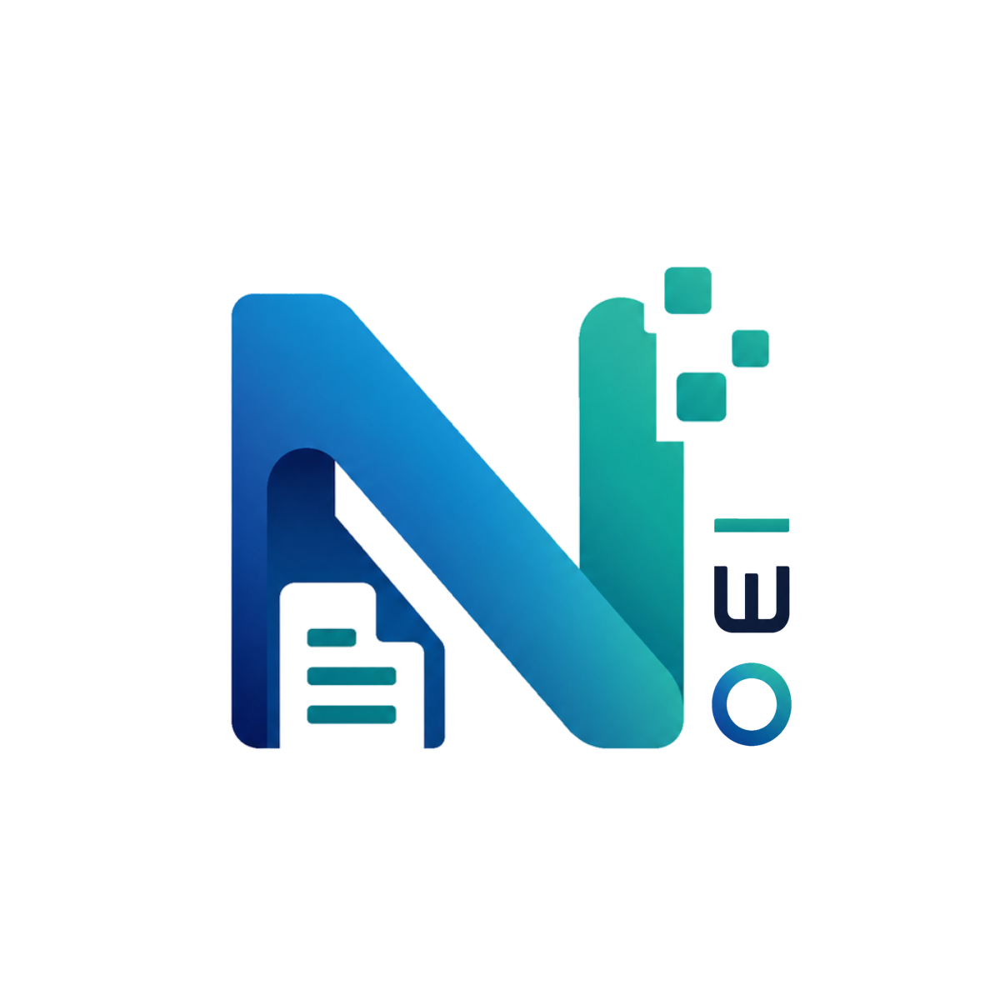

<p align="center">
  
</p>

<h1 align="center">NOEI CMS</h1>

<p align="center">
  <strong>A modern, lightweight, secure, and shared-hosting-first PHP Content Management System.</strong>
</p>

<p align="center">
  <a href="https://github.com/yaratul2005/NOEI/actions"></a>
  <a href="https://php.net"></a>
  <a href="https://www.mysql.com"></a>
  <a href="LICENSE"></a>
</p>

---

## 🎯 Core Mission

> *"A modern CMS that is as easy to install as WordPress, as affordable as shared hosting, but faster, safer, cleaner, and more extensible."*

Traditional CMS platforms have become bloated with heavy runtime dependencies, node builds, and legacy database overhead. **NOEI CMS** is engineered from the ground up for standard, low-cost shared hosting environments (cPanel, DirectAdmin, Apache, LiteSpeed) while delivering modern architecture, strict security, and headless API capabilities.

---

## ✨ Key Features & Architecture

- 🚀 **Zero Mandatory Infrastructure Overhead:** Runs on shared hosting with standard PHP and MySQL/MariaDB. Never requires Node.js, NPM build steps, Redis, Composer at runtime, or SSH CLI access.
- 🛡️ **Security by Design:** 100% parameterized PDO prepared statements, cryptographic CSRF token validation on all mutations, secure file upload MIME validation (`finfo_file`), and execution denial in upload directories.
- 🌐 **Native Multi-Byte Unicode & i18n:** Full `utf8mb4` encoding across database tables and connections. Supports English, Bangla (`বাংলা`), unicode scripts, and diacritics with collision-resistant slug generation.
- 🎨 **Theme Engine & Visual Menu Builder:** Flexible template hierarchy (`front-page.php` &rarr; `home.php` &rarr; `index.php`), custom template overrides, and nested navigation menu builder.
- 🖼️ **Pure-PHP Media Pipeline:** Drag-and-drop file uploader with automated pure-PHP GD image resizing (`thumbnail`, `medium`, `large` variants) and media picker modal.
- 🧩 **Manifest-Governed Extension Modules:** Isolated modular extension engine declaring capabilities in `module.json` with safe `Action` and `Filter` hook pipelines (`the_content`, `init`, `admin_menu`, `theme_head`).
- 💾 **Zero-Binary Backup & One-Click Rollback:** Pure PDO database DDL/DML dumper without requiring `mysqldump` shell binaries, automated pre-update safety snapshots, and instant one-click rollback.
- ⚡ **Headless RESTful API:** Standardized JSON endpoints (`/api/v1/posts`, `/pages`, `/categories`, `/tags`, `/media`, `/site`) with CORS support and Bearer/API-Key token authentication.

---

## 📋 Server Requirements

- **PHP:** 8.1, 8.2, or 8.3 with `declare(strict_types=1);`
- **Database:** MySQL 5.7+, MySQL 8.0+, or MariaDB 10.3+
- **PHP Extensions:** `pdo_mysql`, `mbstring`, `gd` (or `imagick`), `curl`, `json`, `zip`
- **Web Server:** Apache 2.4+ (with `mod_rewrite` enabled) or LiteSpeed / Nginx

---

## 🚀 3-Step Installation Guide

1. **Download & Upload:**
   Download the latest release zip (`noei-cms-latest.zip`) from [Releases](https://github.com/yaratul2005/NOEI/releases) and extract the contents to your server's web root (e.g. `public_html/`).

2. **Run the Browser Setup Wizard:**
   Open your domain in any browser (e.g. `https://example.com`). You will be automatically directed to the interactive installer at `/install/`.

3. **Complete Configuration:**
   - The installer performs automated pre-flight environment checks.
   - Enter your MySQL database credentials.
   - Configure your site title and administrator account.
   - Upon completion, the installer automatically locks itself for security.

---

## 📂 Project Structure

```
├── app/
│   ├── Controllers/          # Admin, Public, and API request handlers
│   │   ├── Admin/            # Admin Panel Controllers (Auth, Posts, Media, Users, Settings)
│   │   └── Api/              # Headless REST API Controllers
│   ├── Middleware/           # Auth, CSRF, CORS, API Token filters
│   ├── Models/               # Data structures (Post, Taxonomy, Media)
│   ├── Services/             # Core business logic (Slug, Seo, Backup, Update, Module)
│   └── Views/                # Server-rendered templates (Admin views)
├── config/
│   ├── app.php               # System constants
│   ├── database.sample.php   # Database configuration template
│   └── permissions.php       # System roles & capability matrix
├── core/
│   ├── Autoloader.php        # Native PSR-4 fallback autoloader
│   ├── Database.php          # PDO singleton connection wrapper
│   ├── Event.php             # Hook & event dispatcher (Actions & Filters)
│   ├── Request.php           # HTTP request abstraction
│   ├── Response.php          # HTTP response & JSON helper
│   ├── Router.php            # Regex-based URL router
│   └── View.php              # Template rendering engine with auto-escaping
├── install/                  # Browser setup wizard (auto-locks after setup)
├── modules/                  # Modular extension plugins (e.g. sample-notice)
├── storage/
│   ├── backups/              # Database SQL dumps & pre-update snapshots
│   ├── cache/                # Query, template & sitemap XML cache
│   ├── logs/                 # Error and audit logs
│   └── uploads/              # User-uploaded media & generated thumbnails
├── themes/
│   └── default/              # Default theme templates and assets
├── index.php                 # Public Front Controller entry point
├── .htaccess                 # Apache rewrite rules & security hardening
└── robots.txt                # Dynamic search engine directives
```

---

## 🔌 Headless REST API Overview

NOEI CMS includes built-in headless RESTful endpoints returning standardized JSON envelopes:

```http
GET /api/v1/posts?page=1&per_page=10&category=news
GET /api/v1/posts/hello-world
POST /api/v1/posts (Header: Authorization: Bearer <token>)
GET /api/v1/pages/about-us
GET /api/v1/categories
GET /api/v1/site
```

### Standard Response Envelope:
```json
{
  "success": true,
  "data": [ ... ],
  "pagination": {
    "page": 1,
    "per_page": 10,
    "total": 24,
    "total_pages": 3
  }
}
```

---

## 🧪 Testing & Verification

NOEI CMS includes 10 standalone verification test suites covering the entire vertical slice without third-party runner dependencies:

```bash
php tests/test_core.php        # Core Router, Request, Response, PDO Wrapper, Events
php tests/test_milestone2.php  # Database Schema, CSRF & Setup Wizard
php tests/test_milestone3.php  # Admin Shell, Auth & RBAC
php tests/test_milestone4.php  # Posts, Pages, Revisions, Taxonomies & Slugs
php tests/test_milestone5.php  # Media Upload Pipeline & GD Resizer
php tests/test_milestone6.php  # Themes, Menus & Public Frontend
php tests/test_milestone7.php  # Options, SEO Head, Sitemap XML & Settings
php tests/test_milestone8.php  # Extension Modules & Manifest Discovery
php tests/test_milestone9.php  # Backup Dumper, One-Click Updates & Rollback
php tests/test_milestone10.php # REST API, CORS & Token Authentication
```

---

## 🤝 Contributing

Contributions, issues, and feature requests are welcome! Please read [CONTRIBUTING.md](CONTRIBUTING.md) for details on code style (PSR-12, strict types, parameterized PDO queries).

---

## 🔒 Security

If you discover a security vulnerability within NOEI CMS, please review [SECURITY.md](SECURITY.md) for our disclosure policy.

---

## 📄 License

NOEI CMS is open-source software licensed under the [MIT License](LICENSE).
